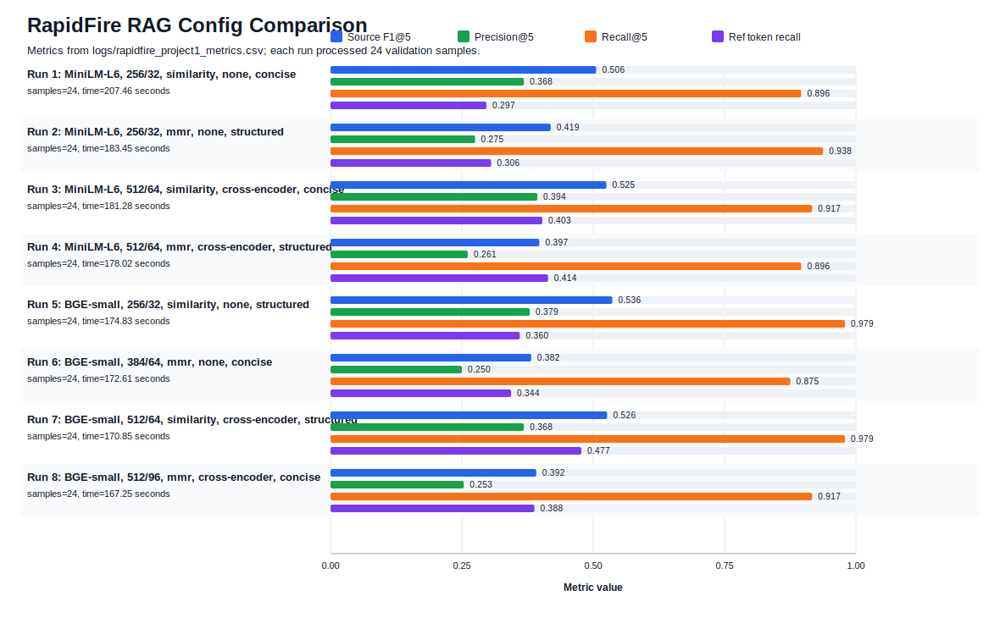

# RapidFire RAG Config Comparison

This artifact summarizes the RapidFire AI OSS multi-config experiment logs and metrics.
It is generated from `logs/rapidfire_project1_metrics.csv` and links the comparison chart below.

## Launch and Run Evidence

- Source log: `logs/rapidfire_project1_rapidfire.log`
- Metrics table: `logs/rapidfire_project1_metrics.csv`
- Raw results: `logs/rapidfire_project1_results.json`
- Runs info: `logs/rapidfire_project1_runs_info.csv`

Selected log lines showing RapidFire startup and multi-config execution:

- `2026-05-03 23:26:03 | Experiment | INFO | experiment.py:226 | [project1-rapidfire-rag-contexteng:Experiment] Using existing dispatcher/api server at 127.0.0.1:8851.`
- `2026-05-03 23:26:03 | Experiment | INFO | experiment.py:383 | [project1-rapidfire-rag-contexteng:Experiment] Running multi-config experiment with 8 shard(s), (0.0 GPUs per actor, 8.0 CPUs per actor, 6 actors)`
- `2026-05-03 23:26:04 | Controller | INFO | controller.py:900 | [project1-rapidfire-rag-contexteng:Controller] Received 8 pipeline configuration(s)`
- `2026-05-03 23:26:27 | DocProcessingActor | INFO | doc_actor.py:107 | [project1-rapidfire-rag-contexteng:DocProcessingActor] Building document index...`
- `2026-05-03 23:26:27 | DocProcessingActor | INFO | doc_actor.py:107 | [project1-rapidfire-rag-contexteng:DocProcessingActor] Building document index...`
- `2026-05-03 23:26:27 | DocProcessingActor | INFO | doc_actor.py:107 | [project1-rapidfire-rag-contexteng:DocProcessingActor] Building document index...`
- `2026-05-03 23:26:27 | DocProcessingActor | INFO | doc_actor.py:107 | [project1-rapidfire-rag-contexteng:DocProcessingActor] Building document index...`
- `2026-05-03 23:26:48 | DocProcessingActor | INFO | doc_actor.py:109 | [project1-rapidfire-rag-contexteng:DocProcessingActor] Document index built successfully`

## Summary

- Best Source F1@5: Run 5 (Run 5: BGE-small, 256/32, similarity, none, structured) = 0.5363.
- Best reference-token recall: Run 7 (Run 7: BGE-small, 512/64, similarity, cross-encoder, structured) = 0.4774.
- All runs used `api-llama-4-scout` with temperature 0.0 and max_tokens 300.

## Config and Metric Table

| Run | Embedding | Chunk | Search | Reranker | Samples | Precision@5 | Recall@5 | Source F1@5 | Hit Rate | Ref Token Recall |
|---:|---|---:|---|---|---:|---:|---:|---:|---:|---:|
| 1 | MiniLM-L6 | 256/32 | similarity | none | 24 | 0.3681 | 0.8958 | 0.5056 | 0.9167 | 0.2967 |
| 2 | MiniLM-L6 | 256/32 | mmr | none | 24 | 0.2750 | 0.9375 | 0.4190 | 0.9583 | 0.3056 |
| 3 | MiniLM-L6 | 512/64 | similarity | cross-encoder | 24 | 0.3937 | 0.9167 | 0.5250 | 0.9583 | 0.4031 |
| 4 | MiniLM-L6 | 512/64 | mmr | cross-encoder | 24 | 0.2611 | 0.8958 | 0.3974 | 0.9167 | 0.4140 |
| 5 | BGE-small | 256/32 | similarity | none | 24 | 0.3792 | 0.9792 | 0.5363 | 1.0000 | 0.3604 |
| 6 | BGE-small | 384/64 | mmr | none | 24 | 0.2500 | 0.8750 | 0.3819 | 0.9167 | 0.3437 |
| 7 | BGE-small | 512/64 | similarity | cross-encoder | 24 | 0.3681 | 0.9792 | 0.5264 | 1.0000 | 0.4774 |
| 8 | BGE-small | 512/96 | mmr | cross-encoder | 24 | 0.2535 | 0.9167 | 0.3917 | 0.9583 | 0.3880 |

## Interpretation

Run 5, the BGE-small 256/32 similarity-search configuration without reranking, had the strongest Source F1@5. Run 7 had the strongest reference-token recall, but its source F1 was slightly lower. In this corpus, BGE improved recall over MiniLM, while MMR and cross-encoder reranking did not consistently improve source-span metrics.
